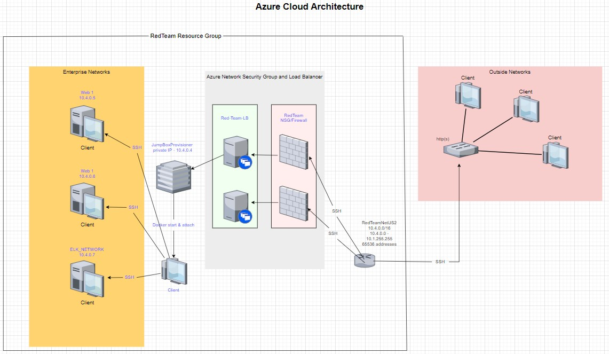
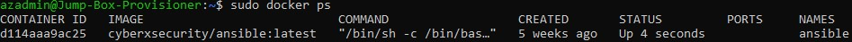

## Automated ELK Stack Deployment

The files in this repository were used to configure the network depicted below.

These files have been tested and used to generate a live ELK deployment on Azure. They can be used to recreate the entire deployment pictured above. Alternatively, select portions of the Ansible file may be used to install only certain pieces of it, such as Filebeat.

  - Hosts file to configure Ansible on the JumpBox - 
  https://github.com/austin-gr/CybersecurityBootcamp/blob/main/Project1_Elk_Stack/Ansible/hosts_on_jumpbox.txt
  - Configure Ansible on the JumpBox - https://github.com/austin-gr/CybersecurityBootcamp/blob/main/Project1_Elk_Stack/Ansible/ansible_ansible_config.cfg
  - Hosts file to configure ELK stack from Ansible container - https://github.com/austin-gr/CybersecurityBootcamp/blob/main/Project1_Elk_Stack/Ansible/hosts_on_ansible_container.txt
  - Configure ELK Stack on Ansible container - https://github.com/austin-gr/CybersecurityBootcamp/blob/main/Project1_Elk_Stack/Ansible/ansible_ELKconfig.cfg
  - Playbook to configure ELK Stack - https://github.com/austin-gr/CybersecurityBootcamp/blob/main/Project1_Elk_Stack/Ansible/ELK-playbook.yml
  - filebeat configuration file - https://github.com/austin-gr/CybersecurityBootcamp/blob/main/Project1_Elk_Stack/Ansible/filebeat-config.yml
  - Playbook to configure filebeat - https://github.com/austin-gr/CybersecurityBootcamp/blob/main/Project1_Elk_Stack/Ansible/filebeat-playbook.yml
  - metricbeat configuration file - https://github.com/austin-gr/CybersecurityBootcamp/blob/main/Project1_Elk_Stack/Ansible/metricbeat-config.yml
  - Playbook to configure metricbeat - https://github.com/austin-gr/CybersecurityBootcamp/blob/main/Project1_Elk_Stack/Ansible/metricbeat-playbook.yml
  - Playbook to configure Web servers with DVWA (D*mn Vulnerable Web Application) - https://github.com/austin-gr/CybersecurityBootcamp/blob/main/Project1_Elk_Stack/Ansible/pentest.yml

This document contains the following details:
- Description of the Topology
- Access Policies
- ELK Configuration
  - Beats in Use
  - Machines Being Monitored
- How to Use the Ansible Build

### Description of the Topology

The main purpose of this network is to expose a load-balanced and monitored instance of DVWA, the D*mn Vulnerable Web Application.

Load balancing ensures that the application will be highly available, in addition to restricting access to the network.
- Load balancers help protect against Distributed Denial-of-service (DDoS) attacks.
- A Jump Box provides isolation and network segmentation, which can be considered best practices. Using a Jump Box also serves to monitor and log activity.

Integrating an ELK server allows users to easily monitor the vulnerable VMs for changes to the log files and system resources.
- Filebeat - centralizes log data and communicates any changes to the Elasticsearch host
- Metricbeat - records system metrics and metrics for services running on the server, and communicates them with the Elasticsearch host

The configuration details of each machine may be found below.

| Name     | Function                    | IP Address | Operating System |
|----------|-----------------------------|------------|------------------|
| Jump Box | Gateway                     | 10.4.0.4   | Linux            |
| Web1     | Web Application             | 10.4.0.5   | Linux            |
| Web2     | Web Application             | 10.4.0.6   | Linux            |
| ELK      | Elastisearch / log security | 10.4.0.7   | Liunx            |

### Access Policies

The machines on the internal network are not exposed to the public Internet. 

Only the JumpBox machine can accept connections from the Internet. Access to this machine is only allowed from the following IP addresses:
- 73.173.75.207

Machines within the network can only be accessed by SSH.
- The only machine with access to the ELK VM is the JumpBox (IP address: 10.4.0.4).

A summary of the access policies in place can be found in the table below.

| Name      | Publicly Accessible | Allowed IP Addresses |
|-----------|---------------------|----------------------|
| Jump Box  | Yes                 | 73.173.75.207        |
| Web 1 & 2 | No                  | 10.4.0.4             |
| ELK       | No                  | 10.4.0.4             |

### Elk Configuration

Ansible was used to automate configuration of the ELK machine. No configuration was performed manually, which is advantageous because...
- Ansible is simple to set up and to use, allowing for the modeling of complex IT workflows with relative ease.
- This means no advanced coding skills are needed, and configuration errors are minimized

The playbook implements the following tasks:
- Install docker.io - install the core docker code to the remote server
- Install pip3 - this package manager enables the installation and use of 3rd party software found outside the standard Python library
- Install the Python Docker module - Instructs pip3 to install the required docker component modules
- Download and launch a docker ELK container - download the ELK docker container; initialize the container with specified published ports

Other configuration modules in the Playbook YAML file increased the memory of the ELK docker image and enabling the docker service.

The following screenshot displays the result of running `docker ps` after successfully configuring the ELK instance.

### Target Machines & Beats
This ELK server is configured to monitor the following machines:
- 10.4.0.4 (JumpBox)
- 10.4.0.5 (Web1)
- 10.4.0.6 (Web2)
- 10.4.0.7 (ELK)

We have installed the following Beats on these machines:
- filebeats (on Web1, Web2, and ELK)
- metricbeats (on Web1, Web2, and ELK)

These Beats allow us to collect the following information from each machine:
- filebeats collects system log events (e.g. tracking logon events, including attempts, successes, and failures for each user)
- metricbeats collects metrics and statistics from the operating system and services running on the server (e.g. cpu and memory usages)

### Using the Playbook
In order to use the playbook, you will need to have an Ansible control node already configured. Assuming you have such a control node provisioned: 

SSH into the control node and follow the steps below:
- Copy the Ansible Playbook file to Docker.
- Update the Hosts file to include the ELK IP.
- Run the playbook, and navigate to Kibana to check that the installation worked as expected.

_TODO: Answer the following questions to fill in the blanks:_
- The playbook is the file named *ELK-playbook.yml*. Copy it to */etc/ansible/*.
- Update *hosts.txt* file to make Ansible run the playbook on (a) specific machine(s). In the listing above, this is listed as "*hosts_on_ansible_container.txt*." To specify on which machine(s) to install the ELK servers versus which to install filebeat on, separate these machines into distinct groups in the *hosts.txt* file. In the Playbook for installing the ELK server or filebeat, only identify the grouping (from the *hosts.txt* file just updated) wanted for that particular playbook.
- To check that the ELK server is running, navigate to the following: http://20.110.253.198:5601/app/kibana
   - *Note*: change the IP address to the public IP of your *ELK server* machine

_As a **Bonus**, provide the specific commands the user will need to run to download the playbook, update the files, etc._
